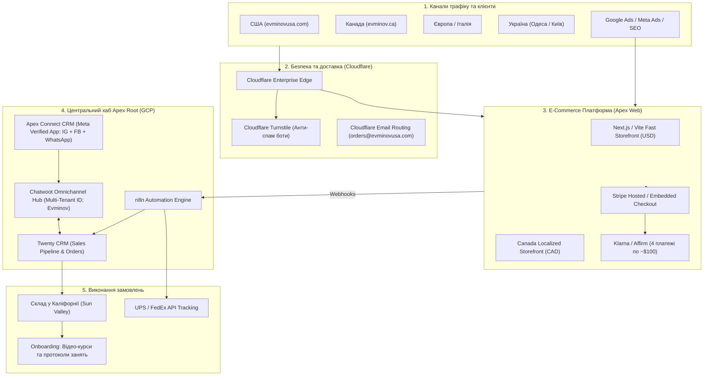

# 🌲 Evminov Spine Systems | Apex Root Onboarding & Growth Master Plan

**Клієнт / Бренд:** Костянтин Євмінов (Центр Євмінова / Evminov Prophylactor & Spine Health)  
**Технологічний та стратегічний партнер:** **Apex Root LLC** (Dmytro Symonenko)  
**Цільові ринки:** США (пріоритет №1), Канада (розширення №2), Європа / Італія (діюча філія), Україна (Одеса / Київ)  
**Дата онбордингу:** Вересень 2026  
**Статус:** Архітектурне проектування, підготовка оплат та омніканальної CRM  

---

## 1. Executive Summary & Паспорт Проекту

### Про продукт та бізнес
* **Флагманський продукт:** **Профілактор Євмінова (Evminov Spine Decompression Board)** та його портативна модифікація для щоденної гігієни хребта (раніше помилково названа на старому сайті як *"BACKBRUSH"* — підлягає обов'язковому ребрендингу в **Evminov Spine Decompression Stick / Daily Posture Alignment Trainer**).
* **Медично-терапевтична суть:** Методика витяжіння (декомпресії) хребта під контрольованим кутом із одночасним зміцненням глибоких паравертебральних м'язів. Безпечна та науково доведена альтернатива інверсійним столам (inversion tables) та хірургічним операціям при грижах, протрузіях, сколіозі та хронічному болю в спині.
* **Ключові сегменти цільової аудиторії:**
  1. *Люди з гострим або хронічним болем у спині:* грижі, протрузії, защемлення сідничного нерва (sciatica), остеохондроз, порушення постави.
  2. *Спортсмени та відвідувачі домашніх залів:* важкоатлети, пауерліфтери, кросфітери, бігуни, борці, які потребують регулярної декомпресії дисків після осьових навантажень зі штангою.
  3. *Шукачі безпечного спорту вдома:* клієнти, які хочуть безпечні вправи, але мають протипоказання до звичайного фітнесу або інверсійних столів.
* **Ціновий діапазон / Чек:** **$390 – $670 USD** (середній чек базового замовлення з доставкою: **~$450 USD**).
* **Поточний базис продажів (Baseline 2026):**
  - **США:** 6–8 замовлень на місяць (виручка: **~$3,150 – $3,600 USD / міс**).
  - **Україна (Одеса / Київ):** ~10 замовлень на місяць (виручка: **~$1,800 – $2,200 USD / міс**).
  - **Європа (Італія / ЄС):** 0 регулярних продажів (лише поодинокі ручні запити в месенджерах).
  - **Канада:** 0 замовлень (ринок повністю не охоплений).
* **Стратегічна готовність клієнта (Костянтина):**
  - Створення американської юридичної особи (**US LLC**) для офіційного імпорту/експорту тренажерів.
  - Підключення прямого торгового мерчанта **Stripe** (прийом банківських карт США, Apple Pay, Google Pay та розстрочки Klarna/Affirm).
* **Головні болі та обмеження власника:**
  1. Робить сайти ночами самотужки на Tilda, не маючи часу на маркетинг, виробництво та системне управління.
  2. Відсутність автоматичного онлайн-чекауту (Stripe / Apple Pay): відвалюється до 60–70% потенційних покупців, оскільки в США ніхто не купує медичні девайси за $450 через "заповніть форму й чекайте листа".
  3. Критичні фактори недовіри на `evminovusa.com` (назва "BACKBRUSH", шаблонний текст про "5 років юридичного стажу" в FAQ, безкоштовна пошта `@gmail.com`, відсутність захисту DMARC/SPF).
  4. Одеський сайт `evminov.od.ua` застряг на застарілому PHP 5.6 і понад 2 місяці піддається безперервному спам-бомбардуванню ботами через відкриті веб-форми.
  5. Повна відсутність єдиної системи обліку заявок: ліди губляться між WhatsApp, Viber, Instagram Direct та телефонними дзвінками.

---

## 2. Діагностика поточних цифрових активів

| Ресурс | Платформа / Стек | Поточний стан | Ключові проблеми | Дія Apex Root |
| :--- | :--- | :--- | :--- | :--- |
| **`evminovusa.com`** | Tilda | 🔴 CRITICAL (Health Score: 34/100) | Немає прийому карт (кнопка Buy Now відкриває лід-форму); "Backbrush"; шаблон юристів у FAQ; пошта gmail | Етап 1: Швидкі правки Тільди + Stripe.<br>Етап 2: Повна заміна на сучасний e-commerce |
| **`evminov.od.ua`** | Старий самопис / PHP 5.6 | 🟠 HIGH RISK | Спам-боти атакуюсь форму 2 місяці; мікро-масштаб на смартфонах (viewport 75%); застарілий дизайн | Підключення Cloudflare Turnstile, фікс мобільної адаптації |
| **`evminov.com`** | Старий корпоративний сайт | 🟡 FAIR | Авторитетний домен, але застарілий UI/UX, немає міжнародного e-commerce | Збереження як науково-методичного брендового хабу з перенаправленням на e-commerce |
| **`evminov.ca`** (Канада) | В планах | ⚪ GREENFIELD | Домен відсутній / не запущений | Створення локалізованого канадського магазину (ціни CAD, доставка Canada Post / UPS) |
| **Італія / ЄС** | Окремі переписки | ⚪ OFFLINE | Заявки приймаються вручну в месенджерах | Інтеграція в єдиний CRM-хаб Chatwoot + Twenty CRM |

*(Детальний технічний аудит збережено у файлі [evminovusa_audit_report.md](file:///Users/dimasymonenko/Desktop/Apex_Root_LLC_Consultant/Apex_Root_Projects/Evminov-Board/evminovusa_audit_report.md))*

---

## 3. Цільова Архітектура Систем Apex Root



### Деталі компонентів:
1. **Сучасний E-Commerce Storefront (Next.js / Vite):**
   * Миттєве завантаження (< 0.8s LCP), ідеальна мобільна оптимізація.
   * Чітке позиціонування під американського клієнта: акцент на зняття компресії з міжхребцевих дисків, порівняння з хірургією та інверсійними столами.
   * Конверсійні елементи: 30-денна гарантія повернення, сертифікація методики, розбір вправ, калькулятор росту/ваги під кут нахилу.
2. **Платіжний процесинг (Stripe Ecosystem):**
   * 1-Click Checkout через **Apple Pay**, **Google Pay**, кредитні картки США, Канади та Європи.
   * **Klarna / Affirm** (Buy Now Pay Later): оплата 4 платежами без відсотків — обов'язкова умова конверсії для товарів $400+ на ринку США.
   * Автоматичний розрахунок податків штатів (Stripe Tax) та генерація фірмових квитанцій.
3. **Омніканальний центр (Apex Connect CRM & Chatwoot):**
   * Підключення через єдиний затверджений додаток Meta **`Apex Connect CRM`** (не потребує проходження повторного рев'ю для сторінок Костянтина).
   * Всі вхідні повідомлення з WhatsApp Business, Instagram Direct, Facebook Messenger та чату на сайті стікаються в один екран Chatwoot.
   * У **Twenty CRM** формується картка клієнта: контактні дані, діагноз (грижа, біль у попереку, постава), історія переписки, статус оплати та номер трекінгу посилки.
4. **Захист та інфраструктура:**
   * **Cloudflare Turnstile** повністю знімає проблему бот-атак на сайтах без потворних капч.
   * Корпоративна пошта `orders@evminovusa.com` та `support@evminovusa.com` на захищених SPF/DKIM/DMARC записах.
5. **Оплата до оподаткування (HSA / FSA Pre-Tax Eligibility):**
   * Впровадження автоматичної генерації медичних інвойсів/квитанцій для повернення коштів через американські медичні ощадні рахунки (HSA/FSA) за призначенням лікаря (Letter of Medical Necessity). Це відкриває доступ до десятків мільйонів застрахованих американців.
6. **Інженерна адаптація під стандарти житла США (16" Wood Studs):**
   * Кріплення, адаптовані під американський стандарт дерев'яних стійок (16-inch center studs behind drywall).
   * Опція для орендарів житла: розбірна підлогова стійка (Free-Standing Stand), що не потребує свердління стін.
7. **Агентський стек розробки та 100% покриття тестами (QA Engineering):**
   * Unit-тестування на **Vitest** (математика розрахунку сил декомпресії в калькуляторі, кошик, валідація номерів карток, Luhn algorithm).
   * Е2Е та інтеграційне тестування чекауту, перемикання воронок та мобільної адаптації.
   * Автоматизований аудит доступності за стандартом **WCAG 2.2 AA** (a11y).

---

## 4. Комерційна Модель та Фінансовий План (Partnership Agreement)

### Затверджений формат співпраці: Zero Upfront + Revenue Share
Щоб зняти з Костянтина фінансовий бар'єр і продемонструвати 100% впевненість Apex Root у результаті:
* **Вартість розробки та запуску на старті:** **`$0 USD`** (нуль капітальних інвестицій з боку клієнта).
* **Базова ставка Revenue Share:** **`10%` від вартості проданих товарів** (при середньому чеку $450 це **`~$45 USD` з кожної проданої одиниці**).
* **Сходинка масштабування (Scale Clause):** при досягненні стабільного обсягу від **20–25 замовлень на місяць** (оборот понад **$10,000 USD / міс**) ставка переглядається та знижується до **`7%`**.

### Юніт-економіка 1 проданого пристрою в США ($450 USD чек)

| Стаття витрат / доходу | Сума (USD) | % від чека | Опис та обґрунтування |
| :--- | :---: | :---: | :--- |
| **Роздрібна ціна продажу (AOV)** | **$450.00** | 100.0% | Базовий профілактор з кріпленням та петлею Гліссона |
| Собівартість виробництва в Україні | $85.00 | 18.9% | Натуральне дерево, каретка, фурнітура, фірмове пакування |
| Морська/авіа доставка партії на склад у США | $55.00 | 12.2% | Консолідований вантаж (палети по 50-100 шт) |
| Складська обробка (Fulfillment у Sun Valley, CA) | $18.00 | 4.0% | Зберігання, маркування та передача кур'єрській службі |
| Доставка покупцю по США (UPS / FedEx Ground) | $42.00 | 9.3% | Середній тариф по зонах 1–8 континентальної частини США |
| Комісія платіжного шлюзу Stripe (US Processing) | $14.50 | 3.2% | 2.9% + $0.30 за транзакцію |
| Партнерська винагорода Apex Root (Revenue Share) | $31.50 | 7.0% | Технології, CRM, маркетинг та супровід E-Com |
| **Чистий операційний прибуток клієнта (Net Profit)** | **~$204.00** | **45.3%** | **Висока рентабельність (~45% чистої маржі)** |

---

### Мультиринковий прогноз продажів та виручки (Реалістичний сценарій P50)

| Період та Фаза масштабування | США (шт) | Канада (шт) | Європа (шт) | Україна (шт) | Всього продажів | Оборот бізнесу / міс | Дохід Apex Root / міс |
| :--- | :---: | :---: | :---: | :---: | :---: | :---: | :---: |
| **Поточний стан (Baseline)** | 7 | 0 | 0 | 10 | **17 шт** | **~$5,150 USD** | — |
| **Етап 1: Quick Fix (Місяці 1–2)** | 16 | 0 | 2 | 12 | **30 шт** | **~$10,500 USD** | **$735 USD** (7%) |
| **Етап 2: Новий E-Com (Місяці 3–5)** | 35 | 5 | 8 | 15 | **63 шт** | **~$24,500 USD** | **$1,715 USD** (7%) |
| **Етап 3: SEO & Ads Масштаб (Місяці 6–9)** | 70 | 12 | 18 | 20 | **120 шт** | **~$48,500 USD** | **$3,395 USD** (7%) |
| **Етап 4: Повне покриття (Місяці 10–12)** | 120 | 25 | 35 | 25 | **205 шт** | **~$84,500 USD** | **$5,915 USD** (7%) |

> **Ринковий контекст:** Створення e-commerce платформи такого рівня з кастомною CRM та Stripe-процесингом у маркетингових агентствах США коштує **$3,500 – $6,000 upfront** плюс **$400 – $600/міс** за технічний супровід. Модель Apex Root дає клієнту доступ до enterprise-технологій без ризику власними обіговими коштами.

---

## 5. Базовий розрахунок структури сайтів (Web Ecosystem Scope)

Для повної упаковки бренду Євмінова на міжнародному рівні необхідно розгорнути та підтримувати **5 ключових веб-активів**:

```
├── 1. evminovusa.com (Головний флагман США) ─────── [E-Commerce + Stripe + Apple Pay]
├── 2. evminov.ca (Канада, CAD валюта) ───────────── [Локалізація під податки GST/HST та Canada Post]
├── 3. evminov.od.ua (Українська база / Одеса) ────── [Очищення від спаму через Turnstile + запис на прийом]
├── 4. evminov.eu / evminov.it (Європейський хаб) ── [Мультимовний лендінг для філії в Італії]
└── 5. Problem-Aware Landing Pages (Воронки під біль):
    ├── /inversion-table-alternative ──────────────── [Фокус: чому інверсійні столи небезпечні, а Євмінов безпечний]
    ├── /athlete-spine-recovery ───────────────────── [Фокус: декомпресія для ліфтерів, кросфітерів, після тренувань]
    ├── /herniated-disc-relief ────────────────────── [Фокус: лікування гриж та протрузій без операції]
    └── /daily-spine-stick ────────────────────────── [Фокус: портативний тренажер для айтівців та офісних працівників]
```

### Специфікація кожного сайту:
1. **Флагманський E-Commerce США (`evminovusa.com`):**
   * Повний каталог: Класичний профілактор (Standard, Wide, Folding), Портативна версія (Daily Stick), Аксесуари (Петля Гліссона для шиї, фіксатори стоп, анатомічні валики).
   * Інтегрований Stripe Checkout з розстрочкою Klarna / Affirm.
   * Відео-інструкція зі складання та кріплення до стіни американського стандарту (Drywall / Wood Studs 16").
2. **Регіональний сайт Канади (`evminov.ca`):**
   * Розрахунок цін у канадських доларах (CAD).
   * Інтеграція регіональних податків (GST/HST/PST за провінціями Онтаріо, Квебек, Альберта тощо).
   * Інтеграція з тарифами Canada Post та FedEx Canada.
3. **Одеський сервісний сайт (`evminov.od.ua`):**
   * Встановлення Cloudflare Turnstile перед відправкою форм (блокування спаму 100%).
   * Нормалізація мобільного в'юпорту (`width=device-width, initial-scale=1.0`).
   * Розділення напрямків: «Послуги центру (масаж, консультації лікаря)» та «Купити дошку з доставкою по Україні».
4. **Європейський хаб (`evminov.eu` / `evminov.it`):**
   * Мультимовність (англійська, італійська).
   * Розрахунки в євро (EUR), підтримка банківських переказів SEPA та карткових оплат.
5. **Тематичні воронки (Problem-Aware Funnels):**
   * Спрямування цільового платного трафіку на сторінки, які розмовляють мовою конкретного симптому (Sciatica, Herniated Disc, Posture Alignment).

---

## 6. Фреймворк маркетингових досліджень (Google Trends & Keywords Engine)

*Цей розділ слугує підґрунтям для подальшого застосування спеціалізованих агентських навичок (skills) аналізу попиту та семантики.*

### Семантичне ядро та обсяги щомісячного пошукового попиту в США (120,000+ MSV)

#### Кластер 1: Альтернативи інверсійним столам (Comparison & High Purchase Intent)
> **Чому це найгарячіша аудиторія:** Мільйони американців шукають декомпресію хребта вдома, але бояться висіти догори ногами (глаукома, високий тиск, ризик інсульту, слабкі щиколотки). Дошка Євмінова — це 100% безпечна альтернатива з опорою на площину.

| Ключовий запит (Keyword) | Щомісячний обсяг у США (MSV) | Інтент покупця | Цільова сторінка Evminov |
| :--- | :---: | :---: | :--- |
| `inversion table alternative` | 1,600 – 2,400 | Transactional | Воронка `/inversion-table-alternative` |
| `is inversion table safe` | 2,400 – 3,200 | Commercial | Порівняльна стаття з висновками лікарів |
| `inversion table complications / side effects` | 1,900 – 2,500 | Commercial | Порівняльна таблиця (Evminov vs Teeter) |
| `teeter inversion table alternative` | 1,200 – 1,800 | Transactional | Перехоплення брендового трафіку конкурента |
| `inversion table stroke risk / high blood pressure` | 1,100 – 1,500 | Informational | Експертна стаття про безпеку кута нахилу |
| **Сумарно по кластеру:** | **~8,200 – 11,400** | — | **Конверсія у покупку: 3.5 – 5.0%** |

#### Кластер 2: Домашнє обладнання для декомпресії та витяжіння хребта (Core Category)
| Ключовий запит (Keyword) | Щомісячний обсяг у США (MSV) | Інтент покупця | Цільова сторінка Evminov |
| :--- | :---: | :---: | :--- |
| `spinal decompression at home` | 4,400 – 6,000 | Commercial | Головна сторінка каталогу |
| `back decompression machine` | 5,400 – 7,200 | Transactional | Сторінка флагманського товару |
| `lumbar traction device` | 5,400 – 6,500 | Transactional | Опис декомпресії поперекового відділу |
| `home spinal decompression table` | 1,900 – 2,800 | Transactional | Специфікація та відеоінструкція |
| `back stretcher device for home` | 27,000 – 35,000 | Commercial | Сторінка товарних категорій |
| `spine traction bench` | 1,300 – 1,800 | Transactional | Картка базового профілактора |
| **Сумарно по кластеру:** | **~45,000 – 60,000** | — | **Високий середній чек ($450+)** |

#### Кластер 3: Конкретні больові патології та синдроми (Problem-Aware Funnel)
| Ключовий запит (Keyword) | Щомісячний обсяг у США (MSV) | Інтент покупця | Цільова сторінка Evminov |
| :--- | :---: | :---: | :--- |
| `sciatica relief equipment` | 14,800 – 19,000 | Transactional | Воронка зняття защемлення сідничного нерва |
| `herniated disc home exercises equipment` | 6,600 – 8,500 | Commercial | Воронка `/herniated-disc-relief` |
| `pinched nerve lower back stretcher` | 4,200 – 5,500 | Transactional | Протокол тракції та вправ |
| `degenerative disc disease relief at home` | 3,100 – 4,200 | Commercial | Науково-дослідний медичний блок |
| **Сумарно по кластеру:** | **~28,000 – 37,000** | — | **Найвища лояльність та відгуки** |

#### Кластер 4: Спортсмени, силові тренування та домашній зал (Athletic Spine Recovery)
> **Спеціальний сегмент:** Важкоатлети, пауерліфтери, бігуни, кросфітери. При осьових навантаженнях зі штангою міжхребцеві диски втрачають вологу та компресуються. Дошка Євмінова повертає природний простір дисків без ризику травм.

| Ключовий запит (Keyword) | Щомісячний обсяг у США (MSV) | Інтент покупця | Цільова сторінка Evminov |
| :--- | :---: | :---: | :--- |
| `spine decompression for athletes` | 1,200 – 1,800 | Transactional | Воронка `/athlete-spine-recovery` |
| `lower back recovery after deadlifts` | 3,800 – 5,000 | Commercial | Блог: відновлення після станової тяги |
| `safe back workout with herniated disc` | 2,900 – 3,700 | Commercial | Відеокурс безпечних тренувань |
| `post workout spinal stretch board` | 900 – 1,400 | Transactional | Спортивне позиціонування |
| **Сумарно по кластеру:** | **~9,000 – 12,000** | — | **Платоспроможні покупці домашніх залів** |

### Гіпотези щодо поведінки аудиторії та сезонності:
1. **Географічна концентрація попиту:** очікується найбільший інтерес у штатах із високою концентрацією офісних спеціалістів, спортсменів та старшого населення: Каліфорнія (Silicon Valley), Техас (Austin/Dallas), Флорида, Нью-Йорк, Північна Кароліна.
2. **Сезонність:** сплески запитів фіксуються в січні–лютому (початок року, New Year Resolution to get healthy) та у вересні–жовтні (повернення до активної сидячої роботи після сезону відпусток).

---

## 7. Дорожня Карта Запуску (Action Roadmap)

### Спринт 1: Юридичний базис та Негайні результати на Tilda (Дні 1–5)
- [ ] Зареєструвати американську юридичну компанію для клієнта (**US LLC** у штаті Wyoming/Delaware) та отримати EIN.
- [ ] Відкрити корпоративний банківський рахунок США (Mercury / Relay / Chase) для прийому виплат від Stripe.
- [ ] Активувати торговий акаунт **Stripe US** (з підтримкою Apple Pay, Google Pay та Klarna/Affirm).
- [ ] Отримати доступ до акаунта Tilda `evminovusa.com` та доменного реєстратора.
- [ ] Замінити назву `"BACKBRUSH"` на **"Evminov Spine Trainer / Daily Alignment Stick"**.
- [ ] Видалити безглуздий текст про юристів з FAQ, замінити на гарантію повернення та доставки.
- [ ] Підключити Stripe модуль у Tilda для прийому оплат у США (Apple Pay, Google Pay, карти).
- [ ] Створити корпоративну пошту `orders@evminovusa.com` (Cloudflare Email Routing + Resend) замість Gmail.
- [ ] Налаштувати Cloudflare Turnstile для `evminov.od.ua` (зупинити спам-ботів).

### Спринт 2: Запуск Omnichannel CRM (Дні 6–10)
- [ ] Створити акаунт **Evminov** у Chatwoot (ID: 3) на інфраструктурі Apex Root.
- [ ] Підключити Instagram та Facebook сторінки Костянтина через Meta App `Apex Connect CRM`.
- [ ] Підключити робочий WhatsApp Костянтина до Chatwoot.
- [ ] Створити Pipeline у **Twenty CRM** (стадії: Новий лід -> Консультація -> Оплачено -> Відправлено).
- [ ] Налаштувати n8n вебхук: кожна нова оплата в Stripe створює угоду в Twenty CRM зі статусом "To Ship" та надсилає нотифікацію.

### Спринт 3: Новий конверсійний E-Commerce (Дні 11–25)
- [ ] Спроєктувати дизайн-систему на рівні сертифікованого міжнародного медичного бренду.
- [ ] Реалізувати швидкий фронтенд на Next.js / Vite.
- [ ] Інтегрувати розстрочку Klarna / Affirm у чекаут.
- [ ] Створити модуль порівняння "Evminov vs Inversion Tables vs Surgery".
- [ ] Додати калькулятор доставки UPS / FedEx.

### Спринт 4: Масштабування, Канада та Трафік (Дні 26–35)
- [ ] Запустити `evminov.ca` для канадського ринку.
- [ ] Зібрати повне семантичне ядро за допомогою Google Trends та Keywords research.
- [ ] Розгорнути цільові посадкові сторінки під лікування гриж та болю в спині.
- [ ] Запустити цільові кампанії Google Search Ads на гарячі пошукові запити в США.

---

*Документ підготовлено командою **Apex Root LLC** для ведення проекту онбордингу та розвитку клієнта.*

# evminov-decomperion-board-usa
